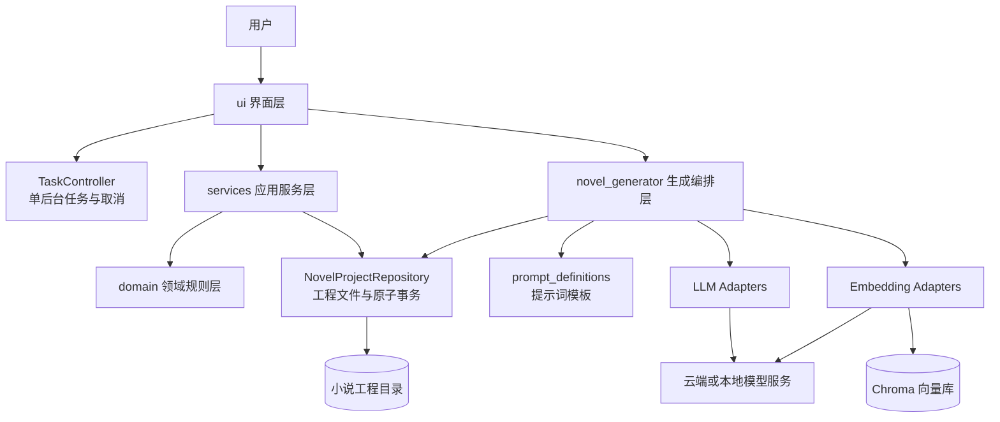
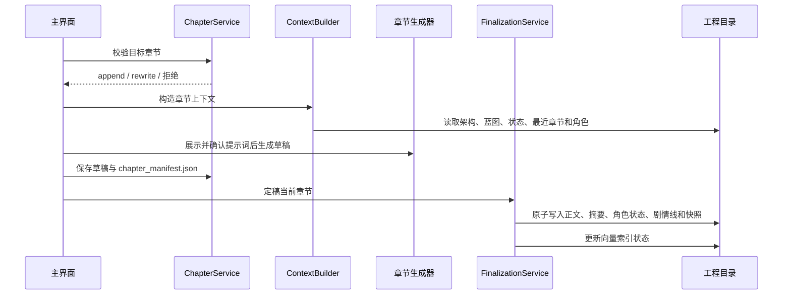

# AI Novel Tools

AI Novel Tools 是一个基于 CustomTkinter 的本地桌面小说辅助创作工具。它把小说创作拆分为“架构规划、章节蓝图、章节草稿、章节定稿”四个阶段，并通过角色库、写作技能、知识向量库、全局摘要和角色状态为后续章节提供连续上下文。

本文档对应当前分支 `codex/refactor-phase1`，说明当前实现的架构、数据约定和使用方式。

## 1. 主要能力

- 多模型配置：可为架构、蓝图、草稿、定稿和一致性审校分别选择 LLM 配置。
- 结构化大纲：以 34 个稳定步骤维护小说大纲，草稿经确认后才渲染为生成器使用的架构文本。
- 结构化章节蓝图：校验章节范围、章节号和必填字段，并同步生成兼容文本。
- 连续章节生成：根据章节清单约束追加、重写、定稿和下游失效状态。
- 上下文增强：组合架构、蓝图、最近三章、摘要、角色状态、剧情线、角色资料、写作技能和知识库检索结果。
- 原子定稿：正文、全局摘要、角色状态、剧情线、章节清单和状态快照以可恢复事务写入。
- 本地知识库：使用 Embedding 和 Chroma 建立、检索及更新工程级向量库。
- 工程管理：支持新建/打开、最近工程切换、旧工程迁移和独立工程参数。
- 辅助功能：一致性审校、批量生成、角色库、写作技能、WebDAV 配置备份与恢复、中英文提示词切换。

## 2. 系统架构



### 2.1 分层职责

| 层 | 主要目录/文件 | 职责 |
| --- | --- | --- |
| 启动层 | `main.py` | 创建 Tk 根窗口和 `NovelGeneratorGUI`，进入事件循环。 |
| 界面层 | `ui/` | 构建标签页、收集参数、展示日志与编辑器、触发后台任务。 |
| 应用服务层 | `services/` | 管理工程、大纲、蓝图、章节上下文、角色/技能和定稿事务。 |
| 领域层 | `domain/` | 定义大纲、蓝图和章节生命周期的状态、校验及纯业务规则。 |
| 生成层 | `novel_generator/` | 组装提示词，调用模型，生成架构/蓝图/正文，维护摘要和向量索引。 |
| 适配层 | `llm_adapters.py`、`embedding_adapters.py` | 屏蔽不同 LLM 与 Embedding 接口差异。 |
| 持久化层 | `services/project_repository.py` | 限制文件访问范围，提供 UTF-8、原子单文件写入和多文件可恢复事务。 |
| 配置层 | `config_manager.py`、`config.json` | 管理模型、任务模型映射、代理、最近工程和 WebDAV 配置。 |

界面层只负责交互；可复用规则位于 `domain` 和 `services`。生成层目前仍保留部分直接文件访问，以兼容旧版生成流程；服务层在其外围完成结构化导入、校验和状态维护。

### 2.2 核心执行链路

#### 生成小说架构

1. 界面根据 `architecture_llm` 取得任务模型配置。
2. 生成器依次生成核心种子、角色动力学、初始角色状态、世界观和三幕式情节。
3. 中途结果写入 `partial_architecture.json`，失败后可从已完成阶段继续。
4. 完整结果先生成兼容文本，再导入 `outline_workflow.json` 成为 AI 草稿。
5. 用户在 `Novel Architecture` 中确认步骤；只有已确认步骤会渲染到 `Novel_architecture.txt`。

#### 生成章节蓝图

1. 读取已确认的 `Novel_architecture.txt`。
2. 根据总章节数和模型 token 上限分段生成章节目录。
3. 将文本解析为结构化章节条目，并校验章节连续性和必填字段。
4. 校验成功后同时写入 `blueprint.json` 和 `Novel_directory.txt`。
5. 校验失败时恢复原目录，并把原始输出保存在 `debug/blueprint_raw_output.txt`。

#### 生成与定稿章节



### 2.3 后台任务模型

`TaskController` 采用单进程、单后台任务策略：同一时间只允许一个模型调用、知识导入或 WebDAV 任务运行。后台线程不直接操作 Tk 控件，完成、失败和清理回调会切回主线程。切换工程或关闭程序时会先请求取消当前任务。

## 3. 数据与文件布局

### 3.1 仓库级文件

```text
AINovelTools/
├─ main.py                    # 程序入口
├─ config.json                # 本机实际配置，包含密钥
├─ config.example.json        # 配置示例
├─ prompt_definitions.py      # 中文提示词
├─ prompt_definitions_en.py   # 英文提示词
├─ domain/                    # 领域规则
├─ services/                  # 应用服务与持久化
├─ novel_generator/           # 生成流程
├─ ui/                        # 桌面界面
└─ tests/                     # 自动化测试
```

`config.json` 中的 API Key 和 WebDAV 密码以明文保存在本机。不要提交、分享或上传该文件；创建公开问题时也不要附带它或完整日志。

### 3.2 小说工程目录

选择一个空目录时，程序会把它初始化为小说工程；打开旧目录时会补齐结构化文件。典型布局如下：

```text
my-novel/
├─ project.json                 # 工程参数与所选写作技能
├─ outline_workflow.json        # 结构化大纲步骤、状态和历史
├─ Novel_architecture.txt       # 已确认大纲的兼容渲染文本
├─ blueprint.json               # 结构化章节蓝图
├─ Novel_directory.txt          # 章节蓝图兼容文本
├─ volume_plan.json             # 分卷规划
├─ chapter_manifest.json        # 章节状态、哈希、快照与索引状态
├─ global_summary.txt           # 全局剧情摘要
├─ character_state.txt          # 当前角色状态
├─ plot_arcs.txt                # 剧情要点、伏笔与冲突
├─ chapters/
│  └─ chapter_N.txt             # 第 N 章正文
├─ chapter_states/
│  └─ chapter_N.json            # 第 N 章定稿后的状态快照
├─ 角色库/
│  ├─ 未分类/
│  └─ 自定义分类/
├─ vectorstore/                 # Chroma 向量数据
├─ debug/                       # 无效模型输出等诊断材料
└─ .transactions/               # 未完成事务的临时恢复数据
```

结构化 JSON 是状态和校验的主要依据；`Novel_architecture.txt` 与 `Novel_directory.txt` 是兼容生成器和人工查看的渲染结果。不要只修改 JSON 的渲染文件后期待结构化状态自动同步，应通过界面保存。

### 3.3 章节状态

| 状态 | 含义 |
| --- | --- |
| `draft` | 普通草稿，尚未定稿。 |
| `draft_modified` | 已定稿章节的正文被修改，需要重新定稿。 |
| `finalized` | 定稿完成；未启用索引时也可处于此状态。 |
| `index_pending` | 正文已原子定稿，但向量索引更新失败。 |
| `stale` | 上游已定稿章节被重写，本章上下文已经失效。 |

生成规则以“从第 1 章开始的最大连续章节”为准：可以重写已有连续章节，也可以生成下一章，但不能跳章。任何 `stale` 章节存在时，必须先重建受影响章节，才能继续向后生成。

## 4. 安装与启动

### 4.1 环境要求

- Windows、macOS 或 Linux 桌面环境；当前分支主要在 Windows 上使用。
- Python 3.12。当前开发环境为 Python 3.12.10。
- 可访问所配置模型服务的网络；使用 Ollama 或 ML Studio 时可连接本地服务。

### 4.2 安装

在仓库根目录执行：

```powershell
py -3.12 -m venv .venv
.\.venv\Scripts\Activate.ps1
python -m pip install --upgrade pip
python -m pip install -r requirements.txt
```

macOS/Linux 激活命令为 `source .venv/bin/activate`。

首次运行若没有 `config.json`，程序会自动创建默认配置。也可以以 `config.example.json` 为参考手工配置，但不要覆盖已有密钥配置。

### 4.3 启动

```powershell
.\.venv\Scripts\python.exe main.py
```

程序窗口默认大小为 `1350 x 840`，运行日志写入仓库根目录的 `app.log`。

## 5. 首次配置

### 5.1 配置 LLM

在主界面右侧 `LLM Model settings` 中：

1. 新增或选择一个配置名称。
2. 选择接口格式，填写 API Key、Base URL 和模型名。
3. 设置 Temperature、Max Tokens 和 Timeout。
4. 点击“测试配置”，确认能返回测试响应。
5. 点击“保存”。

界面当前提供 OpenAI、Azure OpenAI、Ollama、DeepSeek、Gemini 和 ML Studio。适配层还保留 Azure AI、阿里云百炼、火山引擎、硅基流动和 Grok 支持，但这些格式未全部暴露在当前下拉菜单中。

### 5.2 分配任务模型

在 `Config choose` 中分别选择：

| 配置项 | 用途 |
| --- | --- |
| 生成架构所用大模型 | 多阶段小说架构生成。 |
| 生成大目录所用大模型 | 章节蓝图生成。 |
| 生成草稿所用大模型 | 提示词构造、知识筛选和正文草稿。 |
| 定稿章节所用大模型 | 字数扩写及摘要/角色/剧情状态更新。 |
| 一致性审校所用大模型 | 当前章节一致性检查。 |

任务引用的是“配置名称”。重命名或删除配置后，应检查这里的五项选择并重新保存。

### 5.3 配置 Embedding

在 `Embedding settings` 中配置接口、API Key、Base URL、模型名和 Retrieval Top-K，并点击“测试配置”。当前支持 OpenAI、Azure OpenAI、Gemini、Ollama、ML Studio 和 SiliconFlow。

Embedding 用于知识库检索和定稿后的正文向量索引。没有知识库时仍可生成正文；索引失败时正文仍会定稿，但章节状态会标记为 `index_pending`。

### 5.4 代理

在 `Proxy setting` 中填写主机和端口并启用。程序启动后会为当前进程设置 `HTTP_PROXY` 和 `HTTPS_PROXY`。代理值应填写主机，例如 `127.0.0.1`；端口单独填写。

## 6. 标准创作流程

### 6.1 创建或打开工程

1. 在“保存路径”点击“浏览...”。
2. 选择一个空目录以创建工程，或选择已有工程目录以打开/迁移。
3. 最近使用的工程会出现在路径下方的下拉列表中。
4. 填写主题、类型、章节数、每章字数和可选内容指导。

工程参数在切换工程和退出程序时自动保存到工程内的 `project.json`。每个工程有独立参数、角色库和写作技能选择。

### 6.2 Step 1：生成架构

1. 确认主题、类型、章节数、字数和内容指导。
2. 点击“Step1. 生成架构”并确认。
3. 等待日志提示 AI 架构已导入为草稿。
4. 打开 `Novel Architecture` 标签页。
5. 从步骤下拉菜单逐项检查内容，点击“保存草稿”。
6. 对准备投入后续生成的步骤点击“确认并渲染”。

关键点：AI 生成后只是大纲草稿。未确认的步骤不会进入 `Novel_architecture.txt`，因此也不会参与章节蓝图和正文生成。

### 6.3 Step 2：生成章节蓝图

1. 确保架构已经确认并渲染。
2. 点击“Step2. 生成目录”。
3. 在 `Chapter Blueprint` 标签页检查每章标题、定位、作用、悬念、伏笔、转折和简述。
4. 手工修改后点击“保存修改”；保存时会重新解析和校验全部章节。

蓝图必须覆盖 `1..总章节数`，章节号不能重复或缺失。长篇作品会按模型 token 上限分段生成。

### 6.4 可选：准备角色、技能和知识库

- “角色库”：按分类维护角色文本资料。主界面的“核心人物”应使用角色文件名，多个名称用逗号或换行分隔。
- “写作技能”：从全局 `skill_library_path` 读取 `*.json`，所选技能 ID 保存到当前工程。
- “导入知识库”：选择文本文件，将内容分块并写入当前工程的 Chroma 向量库。
- “清空向量库”：双重确认后删除当前工程向量数据；该操作不可恢复。

写作技能文件格式：

```json
{
  "id": "dialogue-natural",
  "name": "自然对话",
  "content": "对话应体现人物关系与潜台词，避免直接解释剧情。"
}
```

### 6.5 Step 3：生成草稿

1. 将章节号设为下一章，例如首次生成填 `1`。
2. 按需填写内容指导、核心人物、关键道具、空间坐标和时间压力。
3. 点击“Step3. 生成草稿”。
4. 程序会显示本次完整请求提示词；可编辑后点击“确认使用”，也可取消请求。
5. 生成结果显示在左侧“本章内容”编辑器中，可直接修改。

提示词会综合当前章节蓝图、下一章蓝图、最近三章、全局摘要、角色状态、剧情线、所选角色资料、写作技能和知识检索结果。

### 6.6 Step 4：定稿章节

1. 在左侧编辑器完成正文修改。
2. 点击“Step4. 定稿章节”并确认。
3. 若正文短于目标字数，可选择让模型扩写。
4. 定稿会更新正文、`global_summary.txt`、`character_state.txt`、`plot_arcs.txt`、章节清单和状态快照。
5. 将章节号改为下一章并重复 Step 3、Step 4。

相同内容重复定稿是幂等操作，不会重复更新状态。重写已定稿章节时，后续已定稿章节会变为 `stale`，需要从受影响位置向后重新生成或定稿。

### 6.7 批量生成

“批量生成”可设置起止章节、期望字数、最低字数以及字数不足时是否自动扩写。批量流程仍受章节连续性约束，建议先用单章流程验证架构、蓝图、模型和 Embedding 配置。

## 7. 其他功能

### 一致性审校

对当前章节正文执行一致性检查，结果输出到主界面日志。它不会自动修改正文，审校后需人工处理建议。

### 章节管理

`Chapters Manage` 可切换、浏览和保存现有章节。保存正文会同步更新 `chapter_manifest.json`；直接在文件系统中修改章节不会立即刷新界面，应点击“刷新章节列表”或重新打开工程。

### 状态编辑

`Character State`、`Global Summary` 和 `Chapter Blueprint` 标签页支持直接加载、编辑与保存对应文本。大纲必须通过 `Novel Architecture` 的步骤工作流维护。

### WebDAV

`Other Settings` 支持连接测试、备份和恢复。当前 WebDAV 功能只备份全局 `config.json` 到远端 `AI_Novel_Generator/config.json`，不备份小说正文、工程目录、角色库或向量库。恢复配置可能切换到配置中记录的当前工程路径。

### 中英文模式

窗口右上角按钮可切换中文/英文提示词定义。它主要影响生成提示词，不会完整翻译所有界面文字和已有工程内容。

## 8. 测试与打包

运行全部测试：

```powershell
.\.venv\Scripts\python.exe -m pytest -q
```

当前测试覆盖配置迁移、工程隔离、路径越界保护、大纲工作流、蓝图校验、章节连续性、原子定稿、事务恢复、角色/技能上下文和端到端核心流程。

仓库包含 `main.spec`，可使用 PyInstaller 打包：

```powershell
python -m pip install pyinstaller
pyinstaller main.spec
```

注意：当前 `main.spec` 的 `customtkinter_dir` 是开发者机器上的绝对路径，跨机器打包前必须改为当前虚拟环境中的 CustomTkinter 路径；其中还列有若干未出现在 `requirements.txt` 的可选隐藏依赖，打包环境可能需要另行安装。

## 9. 故障排查

### 模型测试失败

- 检查接口格式是否与服务兼容。
- 检查 Base URL 是否包含服务要求的路径，例如 OpenAI 兼容服务通常使用 `/v1`。
- 检查模型名、API Key、代理和网络。
- 增大 Timeout；长架构和长章节响应可能明显慢于普通对话。

### 架构生成后目录内容为空

- 打开 `Novel Architecture`，确认 AI 草稿步骤。
- 点击“确认并渲染”，检查 `Novel_architecture.txt` 是否有内容。
- 若架构中途失败，保留 `partial_architecture.json` 后再次生成可续跑。

### 蓝图生成失败

- 检查 `Novel_architecture.txt` 是否包含已确认内容。
- 检查总章节数和模型 Max Tokens。
- 查看 `app.log`；结构校验失败时查看工程内 `debug/blueprint_raw_output.txt`。

### 无法生成指定章节

- 不允许跳章；从章节清单中的第一个缺口继续。
- 若存在 `stale` 状态，先重建受影响的后续章节。
- 检查 `chapter_manifest.json` 与 `chapters/` 是否一致，旧工程重新打开时会自动迁移清单。

### 定稿后显示索引待重建

正文和状态文件已经成功提交，失败的是 Embedding/Chroma 索引，不要把 `index_pending` 误认为正文丢失。先修复 Embedding 配置；服务层提供了 `ChapterFinalizationService.rebuild_index()`，但当前界面尚无重建入口，需要由开发者调用该接口或补充界面操作。

### 程序异常或界面只显示简短错误

详细异常写在仓库根目录 `app.log`。日志默认不记录 API Key，但在对外分享前仍应检查是否包含提示词、正文或服务返回的敏感内容。

## 10. 当前实现边界

- 这是单机桌面应用，没有用户账户、权限控制或多人协作冲突处理。
- 全局配置和密钥是本地明文 JSON，不是系统凭据库。
- WebDAV 仅备份全局配置，不是完整工程备份方案；小说工程仍需独立备份。
- 后台任务是线程级协作取消，正在进行的第三方网络调用不一定能立即中止。
- 生成质量、模型名和可用 token 上限取决于实际模型服务，示例预设不保证所有账户均可调用。
- 工程兼容文本仍被部分生成流程直接读取，因此手工改文件时应保持 UTF-8 编码，并优先通过界面保存。
